[](https://github.com/gongahkia/kite/releases/tag/1.0.0)
[](https://github.com/gongahkia/kite/releases/tag/2.0.0)
[](https://github.com/gongahkia/kite/releases/tag/3.0.0)
[](https://github.com/gongahkia/kite/releases/tag/4.0.0)

# `Kite`

[Extensible library](#architecture) that provides a [bundle of scrapers](#usage) for legal case law from [various jurisdictions](#support) worldwide.

## Architecture

```mermaid
%%{init: {'theme': 'base', 'themeVariables': { 'primaryColor': '#fff5e6', 'edgeLabelBackground':'#fff'}}}%%
flowchart TD
    classDef tests fill:#D1E0FF,stroke:#333;
    classDef scrapers fill:#D1FFD1,stroke:#333;
    classDef utils fill:#FFFFD1,stroke:#333;
    classDef root fill:#FFD1D1,stroke:#333;

    subgraph ROOT["kite (Root)"]
        direction TB
        setup["setup.py"]:::root
        pyproject["pyproject.toml"]:::root
        requirements["requirements.txt"]:::root
        manifest["MANIFEST.in"]:::root
    end

    subgraph PACKAGE["kite/"]
        direction TB
        __init__["__init__.py"]
        cli["cli.py"]

        subgraph SCRAPERS["scrapers/"]
            direction TB
            __init_scrapers["__init__.py"]
            courtlistener["courtlistener.py"]
            findlaw["findlaw.py"]
            canlii["canlii.py"]
            austlii["austlii.py"]
            bailii["bailii.py"]
            singapore["singapore_judiciary.py"]
            indian_kanoon["indian_kanoon.py"]
            hklii["hklii.py"]
            legifrance["legifrance.py"]
            german["german_law_archive.py"]
            curia["curia_europa.py"]
            worldlii["worldlii.py"]
            worldcourts["worldcourts.py"]
            supreme_india["supremecourt_india.py"]
            kenya["kenya_law.py"]
            supreme_japan["supremecourt_japan.py"]
            legal_tools["legal_tools.py"]
        end

        subgraph UTILS["utils/"]
            direction TB
            __init_utils["__init__.py"]
            base["base.py"]
            data_models["data_models.py"]
            exceptions["exceptions.py"]
            helpers["helpers.py"]
        end
    end

    subgraph TESTS["tests/"]
        direction TB
        conftest["conftest.py"]
        test_scrapers["test_scrapers/"]
        test_utils["test_utils/"]
        integration["integration/"]
    end

    %% Relations
    cli --> courtlistener
    cli --> canlii
    cli --> austlii
    cli --> bailii

    courtlistener --> base
    canlii --> base
    austlii --> base
    bailii --> base
    singapore --> base
    indian_kanoon --> base

    base --> data_models
    base --> exceptions
    base --> helpers

    test_scrapers --> courtlistener
    test_scrapers --> canlii
    test_utils --> base
    integration --> cli

    %% Class assignments
    class setup,pyproject,requirements,manifest root
    class __init,cli scrapers
    class courtlistener,findlaw,canlii,austlii,bailii,singapore,indian_kanoon,hklii,legifrance,german,curia,worldlii,worldcourts,supreme_india,kenya,supreme_japan,legal_tools scrapers
    class base,data_models,exceptions,helpers utils
    class conftest,test_scrapers,test_utils,integration tests
```



## Stack

### v1.0.0 and v2.0.0 (Python)

#### Core
* *Language*: [Python 3.9+](https://www.python.org/)
* *HTTP Client*: [requests](https://docs.python-requests.org/), [urllib3](https://urllib3.readthedocs.io/)
* *HTML Parsing*: [BeautifulSoup4](https://www.crummy.com/software/BeautifulSoup/), [lxml](https://lxml.de/)
* *Date Handling*: [python-dateutil](https://dateutil.readthedocs.io/)
* *Text Processing*: [charset-normalizer](https://charset-normalizer.readthedocs.io/)
* *CLI*: [argparse](https://docs.python.org/3/library/argparse.html)

#### Observability
* *Logging*: [structlog](https://www.structlog.org/) 
* *Metrics*: [prometheus-client](https://github.com/prometheus/client_python) 
* *Monitoring*: [psutil](https://psutil.readthedocs.io/) 

#### Development
* *Package Management*: [setuptools](https://setuptools.pypa.io/), [pip](https://pip.pypa.io/)
* *Testing*: [pytest](https://docs.pytest.org/), [pytest-cov](https://pytest-cov.readthedocs.io/), [pytest-mock](https://pytest-mock.readthedocs.io/)
* *Code Quality*: [black](https://black.readthedocs.io/), [flake8](https://flake8.pycqa.org/), [mypy](https://mypy.readthedocs.io/), [isort](https://pycqa.github.io/isort/), [bandit](https://bandit.readthedocs.io/)
* *Pre-commit*: [pre-commit](https://pre-commit.com/) 

#### Deployment
* *Containerization*: [Docker](https://www.docker.com/) 
* *Orchestration*: [Kubernetes](https://kubernetes.io/) 
* *Observability Stack*: [Prometheus](https://prometheus.io/), [Grafana](https://grafana.com/) 

### v3.0.0 (Nim)

#### Core
* *Language*: [Nim](https://nim-lang.org/) 
* *CLI*: [cligen](https://github.com/c-blake/cligen)
* *HTTP Client*: [httpx](https://github.com/avdvalk/nim-httpx)
* *Parsing*: [re](https://nim-lang.org/docs/re.html), [htmlparser](https://nim-lang.org/docs/htmlparser.html) 
* *Data*: [json](https://nim-lang.org/docs/json.html)

#### Observability
* *Logging*: [chronicles](https://github.com/status-im/nim-chronicles) 
* *Metrics*: [Prometheus exposition format](https://prometheus.io/docs/instrumenting/exposition_formats/) 

#### Development
* *Build/Package*: [nimble](https://github.com/nim-lang/nimble)
* *Testing*: [unittest](https://nim-lang.org/docs/unittest.html)

#### Deployment
* *Containerization*: [Docker](https://www.docker.com/) 
* *Orchestration*: [Kubernetes](https://kubernetes.io/) 
* *Observability Stack*: [Prometheus](https://prometheus.io/), [Grafana](https://grafana.com/)

### v4.0.0 (Go)

#### Core
* *Language*: [Go 1.22+](https://go.dev/)
* *Web Framework*: [Fiber v2](https://gofiber.io/)
* *HTTP Client*: [net/http](https://pkg.go.dev/net/http)
* *Scraping*: [Colly v2](https://go-colly.org/), [goquery](https://github.com/PuerkitoBio/goquery), [chromedp](https://github.com/chromedp/chromedp)
* *HTML Parsing*: [goquery](https://github.com/PuerkitoBio/goquery)
* *RPC*: [gRPC](https://grpc.io/), [Protocol Buffers](https://protobuf.dev/)
* *CLI*: [cobra](https://github.com/spf13/cobra)

#### Observability
* *Logging*: [zerolog](https://github.com/rs/zerolog) or [zap](https://github.com/uber-go/zap)
* *Metrics*: [prometheus/client_golang](https://github.com/prometheus/client_golang)
* *Tracing*: [OpenTelemetry](https://opentelemetry.io/docs/languages/go/)
* *Profiling*: [pprof](https://pkg.go.dev/net/http/pprof)

#### Development
* *Package Management*: [Go Modules](https://go.dev/ref/mod)
* *Testing*: [testify](https://github.com/stretchr/testify), [gomock](https://github.com/golang/mock), [testcontainers-go](https://golang.testcontainers.org/)
* *Code Quality*: [golangci-lint](https://golangci-lint.run/), [staticcheck](https://staticcheck.dev/)
* *Build Automation*: [Makefile](https://www.gnu.org/software/make/), [Taskfile](https://taskfile.dev/)
* *Hot Reload*: [air](https://github.com/cosmtrek/air)

#### Deployment
* *Containerization*: [Docker](https://www.docker.com/) (multi-stage builds)
* *Orchestration*: [Kubernetes](https://kubernetes.io/) 
* *Job Queue*: [NATS](https://nats.io/), [Redis Streams](https://redis.io/docs/data-types/streams/)
* *Observability Stack*: [Prometheus](https://prometheus.io/), [Grafana](https://grafana.com/)

## Usage

Kite v4 is an API-first backend service that exposes RESTful and gRPC endpoints for legal case law scraping and analysis.

### Quick Start

#### 1. Clone and Build

```console
$ git clone https://github.com/gongahkia/kite && cd kite
$ make build
```

#### 2. Run the API Server

```console
$ ./bin/kite-api serve --config configs/default.yaml
```

The API server will start on `http://localhost:8080` by default.

#### 3. Verify Health

```console
$ curl http://localhost:8080/health
{"status":"healthy","version":"4.0.0"}
```

### API Endpoints

#### REST API

Kite exposes the following REST endpoints at `/api/v1/`:

**Search Cases**
```console
GET /api/v1/search
Query Parameters:
  - jurisdiction (required): courtlistener, bailii, canlii, austlii, etc.
  - query (required): search terms
  - limit (optional): max results (default: 10)
  - start_date (optional): YYYY-MM-DD
  - end_date (optional): YYYY-MM-DD
  - court (optional): filter by court name
```

**Get Case by ID**
```console
GET /api/v1/cases/{jurisdiction}/{case_id}
```

**Submit Scraping Job**
```console
POST /api/v1/jobs
Body: {
  "jurisdiction": "courtlistener",
  "action": "search",
  "parameters": {
    "query": "constitutional law",
    "limit": 50
  }
}
```

**Get Job Status**
```console
GET /api/v1/jobs/{job_id}
```

**List Supported Jurisdictions**
```console
GET /api/v1/jurisdictions
```

### Integration Examples

#### Using cURL

**Search for cases:**
```console
$ curl "http://localhost:8080/api/v1/search?jurisdiction=courtlistener&query=privacy%20rights&limit=10"
```

**Get specific case:**
```console
$ curl "http://localhost:8080/api/v1/cases/canlii/2023%20SCC%2015"
```

**Submit background job:**
```console
$ curl -X POST http://localhost:8080/api/v1/jobs \
  -H "Content-Type: application/json" \
  -d '{
    "jurisdiction": "bailii",
    "action": "search",
    "parameters": {
      "query": "contract law",
      "limit": 100
    }
  }'
```

#### Using HTTP Client Libraries

**Python with requests:**
```console
import requests

response = requests.get('http://localhost:8080/api/v1/search', params={
    'jurisdiction': 'courtlistener',
    'query': 'data protection',
    'limit': 5
})
cases = response.json()
```

**JavaScript with fetch:**
```console
const response = await fetch('http://localhost:8080/api/v1/search?' + new URLSearchParams({
  jurisdiction: 'austlii',
  query: 'tort law',
  limit: '10'
}));
const cases = await response.json();
```

**Go with net/http:**
```console
resp, err := http.Get("http://localhost:8080/api/v1/search?jurisdiction=worldlii&query=human%20rights&limit=20")
if err != nil {
    log.Fatal(err)
}
defer resp.Body.Close()
```

#### gRPC Integration

Kite also exposes a gRPC API on port `9090`. Use the Protocol Buffer definitions in `api/proto/` to generate client code:

```console
$ buf generate api/proto
```

Then import and use in your application:
```console
import "kite/api/proto/scraper"

conn, _ := grpc.Dial("localhost:9090", grpc.WithInsecure())
client := scraper.NewScraperServiceClient(conn)
```

#### WebSocket Streaming

For real-time updates, connect to the WebSocket endpoint:

```console
$ wscat -c ws://localhost:8080/ws/jobs/{job_id}
```

### Deployment

#### Docker

```console
$ docker build -t kite:v4 .
$ docker run -p 8080:8080 -p 9090:9090 kite:v4
```

#### Docker Compose

```console
$ docker-compose up -d
```

Services include:
- API server (port 8080)
- gRPC server (port 9090)
- Worker pool (background scraping)
- Redis (job queue)
- Prometheus (metrics)
- Grafana (dashboards)

#### Kubernetes

```console
$ kubectl apply -f deployment/k8s/namespace.yaml
$ kubectl apply -f deployment/k8s/deployment.yaml
$ kubectl apply -f deployment/k8s/service.yaml
```

### Configuration

Edit `configs/default.yaml` to customize:

- **Server settings**: ports, timeouts, rate limits
- **Jurisdiction policies**: rate limits per jurisdiction, robots.txt compliance
- **Worker pool size**: concurrent scraping workers
- **Storage backend**: PostgreSQL, MongoDB, or in-memory
- **Job queue**: NATS or Redis Streams
- **Observability**: logging levels, metrics collection

### API Documentation

Interactive API documentation is available at:

- **Swagger UI**: `http://localhost:8080/swagger`
- **OpenAPI spec**: `http://localhost:8080/openapi.json`
- **gRPC reflection**: enabled on port `9090`

### Monitoring

Access observability endpoints:

- **Prometheus metrics**: `http://localhost:8080/metrics`
- **Health check**: `http://localhost:8080/health`
- **Readiness check**: `http://localhost:8080/ready`
- **Performance profiling**: `http://localhost:8080/debug/pprof`

### Admin CLI

Manage the system using the admin CLI:

```console
$ kite-admin migrate up              # Run database migrations
$ kite-admin workers status          # Check worker health
$ kite-admin jobs stats              # View job queue statistics
$ kite-admin cache flush             # Clear cache
```

### Client Libraries

Official client libraries are available for:

- **Go**: `go get github.com/gongahkia/kite/pkg/client`
- **Python**: `pip install kite-client`
- **JavaScript/TypeScript**: `npm install @kite/client`

Or generate your own from the OpenAPI spec using tools like [openapi-generator](https://openapi-generator.tech/).
```

## Support

> [!NOTE]
> Each jurisdiction's scraper handles document types such as court decisions, judgments, and case law which can be viewed [here](./kite/scrapers/).
>
> To get a new jurisdiction **added** or to **suggest improvements** to existing scrapers, please [open an issue](https://github.com/gongahkia/kite/issues).

`Kite`'s [jurisdiction](https://dictionary.cambridge.org/dictionary/english/jurisdiction)-aware scrapers currently support the following legal databases.

| Database | Jurisdiction | Coverage | Status |
|----------|-------------|----------|---------|
| [CourtListener](./kite/scrapers/courtlistener.py) | United States | Federal & State Courts | ✅ Active |
| [FindLaw](./kite/scrapers/findlaw.py) | United States | Supreme Court & State Law | ✅ Active |
| [AustLII](./kite/scrapers/austlii.py) | Australia/New Zealand | Commonwealth & State Courts | ✅ Active |
| [CanLII](./kite/scrapers/canlii.py) | Canada | Federal & Provincial Courts | ✅ Active |
| [BAILII](./kite/scrapers/bailii.py) | UK & Ireland | All UK & Irish Courts | ✅ Active |
| [Singapore Judiciary](./kite/scrapers/singapore_judiciary.py) | Singapore | Official Court Judgments | ✅ Active |
| [Indian Kanoon](./kite/scrapers/indian_kanoon.py) | India | Federal & State Courts | ✅ Active |
| [HKLII](./kite/scrapers/hklii.py) | Hong Kong | Appellate & Tribunal Cases | ✅ Active |
| [Légifrance](./kite/scrapers/legifrance.py) | France | Supreme & Administrative Courts | ✅ Active |
| [German Law Archive](./kite/scrapers/german_law_archive.py) | Germany | Selected Federal Court Cases | ✅ Active |
| [Curia Europa](./kite/scrapers/curia_europa.py) | European Union | ECJ & General Court | ✅ Active |
| [WorldLII](./kite/scrapers/worldlii.py) | International | Global Legal Databases | ✅ Active |
| [WorldCourts](./kite/scrapers/worldcourts.py) | International | International Court Cases | ✅ Active |
| [Supreme Court of India](./kite/scrapers/supremecourt_india.py) | India | Official Supreme Court | ✅ Active |
| [Kenya Law](./kite/scrapers/kenya_law.py) | Kenya | Kenyan Court Cases | ✅ Active |
| [Supreme Court of Japan](./kite/scrapers/supremecourt_japan.py) | Japan | Japanese Supreme Court | ✅ Active |
| [ICC Legal Tools](./kite/scrapers/legal_tools.py) | International | International Criminal Law | ✅ Active |

## Reference

The name `Kite` is in reference to [Kite](https://hunterxhunter.fandom.com/wiki/Kite) (カイト), a prominent [Hunter](https://hunterxhunter.fandom.com/wiki/Hunter_Association) discipled by [Ging Freecss](https://hunterxhunter.fandom.com/wiki/Ging_Freecss) who later acts as [Gon Freecss](https://hunterxhunter.fandom.com/wiki/Gon_Freecss)'s mentor. He is subsequently killed by the [Royal Guard](https://hunterxhunter.fandom.com/wiki/Royal_Guards) [Neferpitou](https://hunterxhunter.fandom.com/wiki/Neferpitou) and reborn as the [Chimera Ant](https://hunterxhunter.fandom.com/wiki/Chimera_Ants) [Reina](https://hunterxhunter.fandom.com/wiki/Kite#Chimera_Ant) in the [Chimera Ant arc](https://hunterxhunter.fandom.com/wiki/Chimera_Ant_arc) of the ongoing manga series, [HunterXhunter](https://hunterxhunter.fandom.com/wiki/Hunterpedia).  


