[](https://github.com/gongahkia/kite/releases/tag/1.0.0)
[](https://github.com/gongahkia/kite/releases/tag/2.0.0)
[](https://github.com/gongahkia/kite/releases/tag/3.0.0)
[](https://github.com/gongahkia/kite/releases/tag/4.0.0)

# `Kite`

[Extensible library](#architecture) that provides a [bundle of scrapers](#usage) for legal case law from [various jurisdictions](#support) worldwide.

## Architecture

```mermaid
%%{init: {'theme': 'base', 'themeVariables': { 'primaryColor': '#fff5e6', 'edgeLabelBackground':'#fff'}}}%%
flowchart TD
    classDef tests fill:#D1E0FF,stroke:#333;
    classDef scrapers fill:#D1FFD1,stroke:#333;
    classDef utils fill:#FFFFD1,stroke:#333;
    classDef root fill:#FFD1D1,stroke:#333;

    subgraph ROOT["kite (Root)"]
        direction TB
        setup["setup.py"]:::root
        pyproject["pyproject.toml"]:::root
        requirements["requirements.txt"]:::root
        manifest["MANIFEST.in"]:::root
    end

    subgraph PACKAGE["kite/"]
        direction TB
        __init__["__init__.py"]
        cli["cli.py"]

        subgraph SCRAPERS["scrapers/"]
            direction TB
            __init_scrapers["__init__.py"]
            courtlistener["courtlistener.py"]
            findlaw["findlaw.py"]
            canlii["canlii.py"]
            austlii["austlii.py"]
            bailii["bailii.py"]
            singapore["singapore_judiciary.py"]
            indian_kanoon["indian_kanoon.py"]
            hklii["hklii.py"]
            legifrance["legifrance.py"]
            german["german_law_archive.py"]
            curia["curia_europa.py"]
            worldlii["worldlii.py"]
            worldcourts["worldcourts.py"]
            supreme_india["supremecourt_india.py"]
            kenya["kenya_law.py"]
            supreme_japan["supremecourt_japan.py"]
            legal_tools["legal_tools.py"]
        end

        subgraph UTILS["utils/"]
            direction TB
            __init_utils["__init__.py"]
            base["base.py"]
            data_models["data_models.py"]
            exceptions["exceptions.py"]
            helpers["helpers.py"]
        end
    end

    subgraph TESTS["tests/"]
        direction TB
        conftest["conftest.py"]
        test_scrapers["test_scrapers/"]
        test_utils["test_utils/"]
        integration["integration/"]
    end

    %% Relations
    cli --> courtlistener
    cli --> canlii
    cli --> austlii
    cli --> bailii

    courtlistener --> base
    canlii --> base
    austlii --> base
    bailii --> base
    singapore --> base
    indian_kanoon --> base

    base --> data_models
    base --> exceptions
    base --> helpers

    test_scrapers --> courtlistener
    test_scrapers --> canlii
    test_utils --> base
    integration --> cli

    %% Class assignments
    class setup,pyproject,requirements,manifest root
    class __init,cli scrapers
    class courtlistener,findlaw,canlii,austlii,bailii,singapore,indian_kanoon,hklii,legifrance,german,curia,worldlii,worldcourts,supreme_india,kenya,supreme_japan,legal_tools scrapers
    class base,data_models,exceptions,helpers utils
    class conftest,test_scrapers,test_utils,integration tests
```



## Stack

### v1.0.0 and v2.0.0 (Python)

#### Core
* *Language*: [Python 3.9+](https://www.python.org/)
* *HTTP Client*: [requests](https://docs.python-requests.org/), [urllib3](https://urllib3.readthedocs.io/)
* *HTML Parsing*: [BeautifulSoup4](https://www.crummy.com/software/BeautifulSoup/), [lxml](https://lxml.de/)
* *Date Handling*: [python-dateutil](https://dateutil.readthedocs.io/)
* *Text Processing*: [charset-normalizer](https://charset-normalizer.readthedocs.io/)
* *CLI*: [argparse](https://docs.python.org/3/library/argparse.html)

#### Observability
* *Logging*: [structlog](https://www.structlog.org/) 
* *Metrics*: [prometheus-client](https://github.com/prometheus/client_python) 
* *Monitoring*: [psutil](https://psutil.readthedocs.io/) 

#### Development
* *Package Management*: [setuptools](https://setuptools.pypa.io/), [pip](https://pip.pypa.io/)
* *Testing*: [pytest](https://docs.pytest.org/), [pytest-cov](https://pytest-cov.readthedocs.io/), [pytest-mock](https://pytest-mock.readthedocs.io/)
* *Code Quality*: [black](https://black.readthedocs.io/), [flake8](https://flake8.pycqa.org/), [mypy](https://mypy.readthedocs.io/), [isort](https://pycqa.github.io/isort/), [bandit](https://bandit.readthedocs.io/)
* *Pre-commit*: [pre-commit](https://pre-commit.com/) 

#### Deployment
* *Containerization*: [Docker](https://www.docker.com/) 
* *Orchestration*: [Kubernetes](https://kubernetes.io/) 
* *Observability Stack*: [Prometheus](https://prometheus.io/), [Grafana](https://grafana.com/) 

### v3.0.0 (Nim)

#### Core
* *Language*: [Nim](https://nim-lang.org/) 
* *CLI*: [cligen](https://github.com/c-blake/cligen)
* *HTTP Client*: [httpx](https://github.com/avdvalk/nim-httpx)
* *Parsing*: [re](https://nim-lang.org/docs/re.html), [htmlparser](https://nim-lang.org/docs/htmlparser.html) 
* *Data*: [json](https://nim-lang.org/docs/json.html)

#### Observability
* *Logging*: [chronicles](https://github.com/status-im/nim-chronicles) 
* *Metrics*: [Prometheus exposition format](https://prometheus.io/docs/instrumenting/exposition_formats/) 

#### Development
* *Build/Package*: [nimble](https://github.com/nim-lang/nimble)
* *Testing*: [unittest](https://nim-lang.org/docs/unittest.html)

#### Deployment
* *Containerization*: [Docker](https://www.docker.com/) 
* *Orchestration*: [Kubernetes](https://kubernetes.io/) 
* *Observability Stack*: [Prometheus](https://prometheus.io/), [Grafana](https://grafana.com/)

### v4.0.0 (Go)

#### Core
* *Language*: [Go 1.22+](https://go.dev/)
* *Web Framework*: [Fiber v2](https://gofiber.io/)
* *HTTP Client*: [net/http](https://pkg.go.dev/net/http)
* *Scraping*: [Colly v2](https://go-colly.org/), [goquery](https://github.com/PuerkitoBio/goquery), [chromedp](https://github.com/chromedp/chromedp)
* *HTML Parsing*: [goquery](https://github.com/PuerkitoBio/goquery)
* *RPC*: [gRPC](https://grpc.io/), [Protocol Buffers](https://protobuf.dev/)
* *CLI*: [cobra](https://github.com/spf13/cobra)

#### Observability
* *Logging*: [zerolog](https://github.com/rs/zerolog) or [zap](https://github.com/uber-go/zap)
* *Metrics*: [prometheus/client_golang](https://github.com/prometheus/client_golang)
* *Tracing*: [OpenTelemetry](https://opentelemetry.io/docs/languages/go/)
* *Profiling*: [pprof](https://pkg.go.dev/net/http/pprof)

#### Development
* *Package Management*: [Go Modules](https://go.dev/ref/mod)
* *Testing*: [testify](https://github.com/stretchr/testify), [gomock](https://github.com/golang/mock), [testcontainers-go](https://golang.testcontainers.org/)
* *Code Quality*: [golangci-lint](https://golangci-lint.run/), [staticcheck](https://staticcheck.dev/)
* *Build Automation*: [Makefile](https://www.gnu.org/software/make/), [Taskfile](https://taskfile.dev/)
* *Hot Reload*: [air](https://github.com/cosmtrek/air)

#### Deployment
* *Containerization*: [Docker](https://www.docker.com/) (multi-stage builds)
* *Orchestration*: [Kubernetes](https://kubernetes.io/) 
* *Job Queue*: [NATS](https://nats.io/), [Redis Streams](https://redis.io/docs/data-types/streams/)
* *Observability Stack*: [Prometheus](https://prometheus.io/), [Grafana](https://grafana.com/)

## Usage

The below instructions are for running `Kite` on your client machine.

1. Execute the below.

```console
$ git clone https://github.com/gongahkia/kite && cd kite
```

2. To use `Kite` [CLI](./kite/cli.py), run the below.

```console
$ kite search courtlistener "constitutional law" --limit 5
```

3. Alternatively, install from PyPI for library usage.

```console
$ pip install kite
```

4. Most commonly, you would include `Kite` directly as a [Library](https://docs.python.org/3/library/index.html) within your projects.

### [Search](./kite/scrapers/) Cases Across Jurisdictions

```py
from kite import CourtListenerScraper

with CourtListenerScraper() as scraper:
    cases = scraper.search_cases(
        query="privacy rights",
        start_date="2023-01-01",
        limit=10
    )

    for case in cases:
        print(f"{case.case_name} - {case.date}")
        print(f"Court: {case.court}")
        print(f"URL: {case.url}")
```

### [Retrieve](./kite/scrapers/) Specific Cases by ID

```py
from kite import CanLIIScraper

with CanLIIScraper() as scraper:
    case = scraper.get_case_by_id("2023 SCC 15")
    print(f"Case: {case.case_name}")
    print(f"Judges: {', '.join(case.judges)}")
```

### [Multi-jurisdiction](./kite/scrapers/) Research

```py
from kite import CourtListenerScraper, BAILIIScraper, AustLIIScraper

scrapers = [
    ("US", CourtListenerScraper()),
    ("UK", BAILIIScraper()),
    ("AU", AustLIIScraper())
]

query = "data protection"
all_cases = []

for jurisdiction, scraper in scrapers:
    with scraper:
        cases = scraper.search_cases(query=query, limit=5)
        for case in cases:
            case.metadata["jurisdiction"] = jurisdiction
            all_cases.append(case)
```

### [Batch Process](./kite/utils/) with Error Handling

```py
from kite import IndianKanoonScraper
import logging

case_ids = ["AIR 2023 SC 1234", "AIR 2023 SC 5678"]

with IndianKanoonScraper() as scraper:
    for case_id in case_ids:
        try:
            case = scraper.get_case_by_id(case_id)
            if case:
                print(f"Retrieved: {case.case_name}")
        except Exception as e:
            logging.error(f"Failed to retrieve {case_id}: {e}")
```

## Support

> [!NOTE]
> Each jurisdiction's scraper handles document types such as court decisions, judgments, and case law which can be viewed [here](./kite/scrapers/).
>
> To get a new jurisdiction **added** or to **suggest improvements** to existing scrapers, please [open an issue](https://github.com/gongahkia/kite/issues).

`Kite`'s [jurisdiction](https://dictionary.cambridge.org/dictionary/english/jurisdiction)-aware scrapers currently support the following legal databases.

| Database | Jurisdiction | Coverage | Status |
|----------|-------------|----------|---------|
| [CourtListener](./kite/scrapers/courtlistener.py) | United States | Federal & State Courts | ✅ Active |
| [FindLaw](./kite/scrapers/findlaw.py) | United States | Supreme Court & State Law | ✅ Active |
| [AustLII](./kite/scrapers/austlii.py) | Australia/New Zealand | Commonwealth & State Courts | ✅ Active |
| [CanLII](./kite/scrapers/canlii.py) | Canada | Federal & Provincial Courts | ✅ Active |
| [BAILII](./kite/scrapers/bailii.py) | UK & Ireland | All UK & Irish Courts | ✅ Active |
| [Singapore Judiciary](./kite/scrapers/singapore_judiciary.py) | Singapore | Official Court Judgments | ✅ Active |
| [Indian Kanoon](./kite/scrapers/indian_kanoon.py) | India | Federal & State Courts | ✅ Active |
| [HKLII](./kite/scrapers/hklii.py) | Hong Kong | Appellate & Tribunal Cases | ✅ Active |
| [Légifrance](./kite/scrapers/legifrance.py) | France | Supreme & Administrative Courts | ✅ Active |
| [German Law Archive](./kite/scrapers/german_law_archive.py) | Germany | Selected Federal Court Cases | ✅ Active |
| [Curia Europa](./kite/scrapers/curia_europa.py) | European Union | ECJ & General Court | ✅ Active |
| [WorldLII](./kite/scrapers/worldlii.py) | International | Global Legal Databases | ✅ Active |
| [WorldCourts](./kite/scrapers/worldcourts.py) | International | International Court Cases | ✅ Active |
| [Supreme Court of India](./kite/scrapers/supremecourt_india.py) | India | Official Supreme Court | ✅ Active |
| [Kenya Law](./kite/scrapers/kenya_law.py) | Kenya | Kenyan Court Cases | ✅ Active |
| [Supreme Court of Japan](./kite/scrapers/supremecourt_japan.py) | Japan | Japanese Supreme Court | ✅ Active |
| [ICC Legal Tools](./kite/scrapers/legal_tools.py) | International | International Criminal Law | ✅ Active |

## Reference

The name `Kite` is in reference to [Kite](https://hunterxhunter.fandom.com/wiki/Kite) (カイト), a prominent [Hunter](https://hunterxhunter.fandom.com/wiki/Hunter_Association) discipled by [Ging Freecss](https://hunterxhunter.fandom.com/wiki/Ging_Freecss) who later acts as [Gon Freecss](https://hunterxhunter.fandom.com/wiki/Gon_Freecss)'s mentor. He is subsequently killed by the [Royal Guard](https://hunterxhunter.fandom.com/wiki/Royal_Guards) [Neferpitou](https://hunterxhunter.fandom.com/wiki/Neferpitou) and reborn as the [Chimera Ant](https://hunterxhunter.fandom.com/wiki/Chimera_Ants) [Reina](https://hunterxhunter.fandom.com/wiki/Kite#Chimera_Ant) in the [Chimera Ant arc](https://hunterxhunter.fandom.com/wiki/Chimera_Ant_arc) of the ongoing manga series, [HunterXhunter](https://hunterxhunter.fandom.com/wiki/Hunterpedia).  


