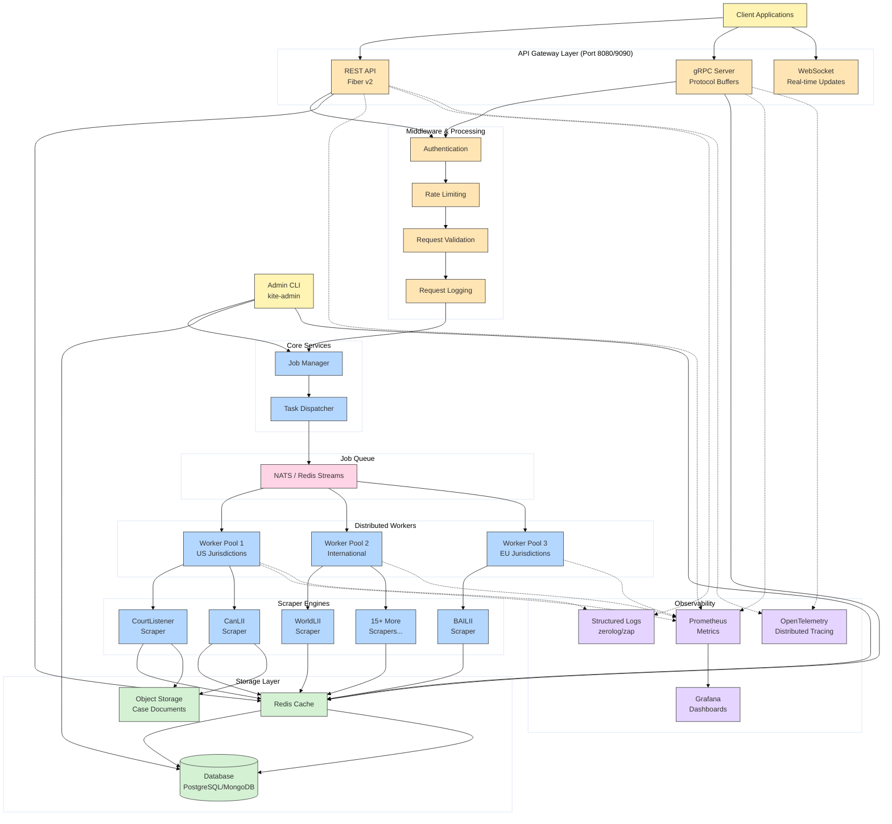

[](https://github.com/gongahkia/kite/releases/tag/1.0.0)
[](https://github.com/gongahkia/kite/releases/tag/2.0.0)
[](https://github.com/gongahkia/kite/releases/tag/3.0.0)
[](https://github.com/gongahkia/kite/releases/tag/4.0.0)

# `Kite`

[Extensible](#architecture) [API backend](#rest-api-endpoints) for scraping legal case law from [17+ jurisdictions](#support) worldwide.

## Usage

1. First run the below commands.

```console
$ git clone https://github.com/gongahkia/kite && cd kite
$ make build
```

2. Run Kite's API server at `http://localhost:8080` with the following commands.

```console
$ ./bin/kite-api serve --config configs/default.yaml
```

## Client Libraries

| Language | Package Manager | Installation Command |
|----------|----------------|---------------------|
| Go | go get | `go get github.com/gongahkia/kite/pkg/client` |
| Python | pip | `pip install kite-client` |
| JavaScript/TypeScript | npm | `npm install @kite/client` |

## Stack

<details>
<summary><strong>v1.0.0 and v2.0.0 (Python)</strong></summary>

#### Core

| Component | Technology |
|-----------|-----------|
| Language | [Python 3.9+](https://www.python.org/) |
| HTTP Client | [requests](https://docs.python-requests.org/), [urllib3](https://urllib3.readthedocs.io/) |
| HTML Parsing | [BeautifulSoup4](https://www.crummy.com/software/BeautifulSoup/), [lxml](https://lxml.de/) |
| Date Handling | [python-dateutil](https://dateutil.readthedocs.io/) |
| Text Processing | [charset-normalizer](https://charset-normalizer.readthedocs.io/) |
| CLI | [argparse](https://docs.python.org/3/library/argparse.html) |

#### Observability

| Component | Technology |
|-----------|-----------|
| Logging | [structlog](https://www.structlog.org/) |
| Metrics | [prometheus-client](https://github.com/prometheus/client_python) |
| Monitoring | [psutil](https://psutil.readthedocs.io/) |

#### Development

| Component | Technology |
|-----------|-----------|
| Package Management | [setuptools](https://setuptools.pypa.io/), [pip](https://pip.pypa.io/) |
| Testing | [pytest](https://docs.pytest.org/), [pytest-cov](https://pytest-cov.readthedocs.io/), [pytest-mock](https://pytest-mock.readthedocs.io/) |
| Code Quality | [black](https://black.readthedocs.io/), [flake8](https://flake8.pycqa.org/), [mypy](https://mypy.readthedocs.io/), [isort](https://pycqa.github.io/isort/), [bandit](https://bandit.readthedocs.io/) |
| Pre-commit | [pre-commit](https://pre-commit.com/) |

#### Deployment

| Component | Technology |
|-----------|-----------|
| Containerization | [Docker](https://www.docker.com/) |
| Orchestration | [Kubernetes](https://kubernetes.io/) |
| Observability Stack | [Prometheus](https://prometheus.io/), [Grafana](https://grafana.com/) |

</details>

<details>
<summary><strong>v3.0.0 (Nim)</strong></summary>

#### Core

| Component | Technology |
|-----------|-----------|
| Language | [Nim](https://nim-lang.org/) |
| CLI | [cligen](https://github.com/c-blake/cligen) |
| HTTP Client | [httpx](https://github.com/avdvalk/nim-httpx) |
| Parsing | [re](https://nim-lang.org/docs/re.html), [htmlparser](https://nim-lang.org/docs/htmlparser.html) |
| Data | [json](https://nim-lang.org/docs/json.html) |

#### Observability

| Component | Technology |
|-----------|-----------|
| Logging | [chronicles](https://github.com/status-im/nim-chronicles) |
| Metrics | [Prometheus exposition format](https://prometheus.io/docs/instrumenting/exposition_formats/) |

#### Development

| Component | Technology |
|-----------|-----------|
| Build/Package | [nimble](https://github.com/nim-lang/nimble) |
| Testing | [unittest](https://nim-lang.org/docs/unittest.html) |

#### Deployment

| Component | Technology |
|-----------|-----------|
| Containerization | [Docker](https://www.docker.com/) |
| Orchestration | [Kubernetes](https://kubernetes.io/) |
| Observability Stack | [Prometheus](https://prometheus.io/), [Grafana](https://grafana.com/) |

</details>

<details>
<summary><strong>v4.0.0 (Go)</strong></summary>

#### Core

| Component | Technology |
|-----------|-----------|
| Language | [Go 1.22+](https://go.dev/) |
| Web Framework | [Fiber v2](https://gofiber.io/) |
| HTTP Client | [net/http](https://pkg.go.dev/net/http) |
| Scraping | [Colly v2](https://go-colly.org/), [goquery](https://github.com/PuerkitoBio/goquery), [chromedp](https://github.com/chromedp/chromedp) |
| HTML Parsing | [goquery](https://github.com/PuerkitoBio/goquery) |
| RPC | [gRPC](https://grpc.io/), [Protocol Buffers](https://protobuf.dev/) |
| CLI | [cobra](https://github.com/spf13/cobra) |

#### Observability

| Component | Technology |
|-----------|-----------|
| Logging | [zerolog](https://github.com/rs/zerolog), [zap](https://github.com/uber-go/zap) |
| Metrics | [prometheus/client_golang](https://github.com/prometheus/client_golang) |
| Tracing | [OpenTelemetry](https://opentelemetry.io/docs/languages/go/) |
| Profiling | [pprof](https://pkg.go.dev/net/http/pprof) |

#### Development

| Component | Technology |
|-----------|-----------|
| Package Management | [Go Modules](https://go.dev/ref/mod) |
| Testing | [testify](https://github.com/stretchr/testify), [gomock](https://github.com/golang/mock), [testcontainers-go](https://golang.testcontainers.org/) |
| Code Quality | [golangci-lint](https://golangci-lint.run/), [staticcheck](https://staticcheck.dev/) |
| Build Automation | [Makefile](https://www.gnu.org/software/make/), [Taskfile](https://taskfile.dev/) |
| Hot Reload | [air](https://github.com/cosmtrek/air) |

#### Deployment

| Component | Technology |
|-----------|-----------|
| Containerization | [Docker](https://www.docker.com/) (multi-stage builds) |
| Orchestration | [Kubernetes](https://kubernetes.io/) |
| Job Queue | [NATS](https://nats.io/), [Redis Streams](https://redis.io/docs/data-types/streams/) |
| Observability Stack | [Prometheus](https://prometheus.io/), [Grafana](https://grafana.com/) |

</details>

## Rest API Endpoints

<details>
<summary><strong>Search Cases</strong></summary>

```console
GET /api/v1/search
Query Parameters:
  - jurisdiction (required): courtlistener, bailii, canlii, austlii, etc.
  - query (required): search terms
  - limit (optional): max results (default: 10)
  - start_date (optional): YYYY-MM-DD
  - end_date (optional): YYYY-MM-DD
  - court (optional): filter by court name
```

</details>

<details>
<summary><strong>Get Case by ID</strong></summary>

```console
GET /api/v1/cases/{jurisdiction}/{case_id}
```

</details>

<details>
<summary><strong>Submit Scraping Job</strong></summary>

```console
POST /api/v1/jobs
Body: {
  "jurisdiction": "courtlistener",
  "action": "search",
  "parameters": {
    "query": "constitutional law",
    "limit": 50
  }
}
```

</details>

<details>
<summary><strong>Get Job Status</strong></summary>

```console
GET /api/v1/jobs/{job_id}
```

</details>

<details>
<summary><strong>List Supported Jurisdictions</strong></summary>

```console
GET /api/v1/jurisdictions
```

</details>

## Quickstart Examples

<details>
<summary><strong>Using cURL</strong></summary>

**Search for cases:**
```console
$ curl "http://localhost:8080/api/v1/search?jurisdiction=courtlistener&query=privacy%20rights&limit=10"
```

**Get specific case:**
```console
$ curl "http://localhost:8080/api/v1/cases/canlii/2023%20SCC%2015"
```

**Submit background job:**
```console
$ curl -X POST http://localhost:8080/api/v1/jobs \
  -H "Content-Type: application/json" \
  -d '{
    "jurisdiction": "bailii",
    "action": "search",
    "parameters": {
      "query": "contract law",
      "limit": 100
    }
  }'
```

</details>

<details>
<summary><strong>Using HTTP Client Libraries</strong></summary>

**Python with requests:**
```console
import requests

response = requests.get('http://localhost:8080/api/v1/search', params={
    'jurisdiction': 'courtlistener',
    'query': 'data protection',
    'limit': 5
})
cases = response.json()
```

**JavaScript with fetch:**
```console
const response = await fetch('http://localhost:8080/api/v1/search?' + new URLSearchParams({
  jurisdiction: 'austlii',
  query: 'tort law',
  limit: '10'
}));
const cases = await response.json();
```

**Go with net/http:**
```console
resp, err := http.Get("http://localhost:8080/api/v1/search?jurisdiction=worldlii&query=human%20rights&limit=20")
if err != nil {
    log.Fatal(err)
}
defer resp.Body.Close()
```

</details>

<details>
<summary><strong>gRPC Integration</strong></summary>

Kite also exposes a gRPC API on port `9090`. Use the Protocol Buffer definitions in `api/proto/` to generate client code:

```console
$ buf generate api/proto
```

Then import and use in your application:
```console
import "kite/api/proto/scraper"

conn, _ := grpc.Dial("localhost:9090", grpc.WithInsecure())
client := scraper.NewScraperServiceClient(conn)
```

</details>

<details>
<summary><strong>WebSocket Streaming</strong></summary>

For real-time updates, connect to the WebSocket endpoint:

```console
$ wscat -c ws://localhost:8080/ws/jobs/{job_id}
```

</details>

## Deployment

<details>
<summary><strong>Docker</strong></summary>

```console
$ docker build -t kite:v4 .
$ docker run -p 8080:8080 -p 9090:9090 kite:v4
```

</details>

<details>
<summary><strong>Docker Compose</strong></summary>

```console
$ docker-compose up -d
```

Services include:
- API server (port 8080)
- gRPC server (port 9090)
- Worker pool (background scraping)
- Redis (job queue)
- Prometheus (metrics)
- Grafana (dashboards)

</details>

<details>
<summary><strong>Kubernetes</strong></summary>

```console
$ kubectl apply -f deployment/k8s/namespace.yaml
$ kubectl apply -f deployment/k8s/deployment.yaml
$ kubectl apply -f deployment/k8s/service.yaml
```

</details>

## Support

`Kite` currently supports the following legal databases across [multiple jurisdictions](https://dictionary.cambridge.org/dictionary/english/jurisdiction).

| Database | Jurisdiction | Coverage | Status |
|----------|-------------|----------|---------|
| CourtListener | United States | Federal & State Courts | ✅ Active |
| FindLaw | United States | Supreme Court & State Law | ✅ Active |
| AustLII | Australia/New Zealand | Commonwealth & State Courts | ✅ Active |
| CanLII | Canada | Federal & Provincial Courts | ✅ Active |
| BAILII | UK & Ireland | All UK & Irish Courts | ✅ Active |
| Singapore Judiciary | Singapore | Official Court Judgments | ✅ Active |
| Indian Kanoon | India | Federal & State Courts | ✅ Active |
| HKLII | Hong Kong | Appellate & Tribunal Cases | ✅ Active |
| Légifrance | France | Supreme & Administrative Courts | ✅ Active |
| German Law Archive | Germany | Selected Federal Court Cases | ✅ Active |
| Curia Europa | European Union | ECJ & General Court | ✅ Active |
| WorldLII | International | Global Legal Databases | ✅ Active |
| WorldCourts | International | International Court Cases | ✅ Active |
| Supreme Court of India | India | Official Supreme Court | ✅ Active |
| Kenya Law | Kenya | Kenyan Court Cases | ✅ Active |
| Supreme Court of Japan | Japan | Japanese Supreme Court | ✅ Active |
| ICC Legal Tools | International | International Criminal Law | ✅ Active |

## Architecture



## Reference

The name `Kite` is in reference to [Kite](https://hunterxhunter.fandom.com/wiki/Kite) (カイト), a prominent [Hunter](https://hunterxhunter.fandom.com/wiki/Hunter_Association) discipled by [Ging Freecss](https://hunterxhunter.fandom.com/wiki/Ging_Freecss) who later acts as [Gon Freecss](https://hunterxhunter.fandom.com/wiki/Gon_Freecss)'s mentor. He is subsequently killed by the [Royal Guard](https://hunterxhunter.fandom.com/wiki/Royal_Guards) [Neferpitou](https://hunterxhunter.fandom.com/wiki/Neferpitou) and reborn as the [Chimera Ant](https://hunterxhunter.fandom.com/wiki/Chimera_Ants) [Reina](https://hunterxhunter.fandom.com/wiki/Kite#Chimera_Ant) in the [Chimera Ant arc](https://hunterxhunter.fandom.com/wiki/Chimera_Ant_arc) of the ongoing manga series, [HunterXhunter](https://hunterxhunter.fandom.com/wiki/Hunterpedia).  


