[](https://github.com/gongahkia/kite/releases/tag/1.0.0) 


# `Kite` 🪄

`Kite` is an all-in-one Python Library designed for [legal technologists](https://www.thomsonreuters.com/en-us/posts/technology/generalist-legal-technologist/) and [tinkerers](tinkerers).
  
It serves [Jurisdiction-aware](#coverage) [OCR](https://en.wikipedia.org/wiki/Optical_character_recognition) with Multi-language [Translation](https://academic.oup.com/book/2473/chapter/142746439), [Document Classification](https://en.wikipedia.org/wiki/Document_classification), [Compliance Flagging](https://acd.mlaw.gov.sg/compliance/red-flag-indicators/) and [Extensible Extraction Rulesets](https://docs.stoplight.io/docs/spectral/83527ef2dd8c0-extending-rulesets).
  
## Stack

* *Script*: [Python](https://www.python.org/)
    * *Parsing and Extraction*: [PyMuPDF](https://pymupdf.readthedocs.io/en/latest/), [python-docx](https://python-docx.readthedocs.io/en/latest/), [pytesseract](https://pypi.org/project/pytesseract/)
    * *Image Enhancement*: [Pillow](https://pillow.readthedocs.io/en/stable/)
    * *NLP*: [spaCy](https://spacy.io/)
    * *Translation*: [googletrans](https://py-googletrans.readthedocs.io/en/latest/)
    * *Configuration Management*: [PyYAML](https://pyyaml.org/)
* *API*: [Flask](https://flask.palletsprojects.com/en/stable/)
* *Package*: [Docker](https://www.docker.com/)
* *Testing*: [pytest](https://docs.pytest.org/en/stable/), [pre-commit](https://pre-commit.com/)
* *Linting*: [isort](https://pycqa.github.io/isort/), [black](https://pypi.org/project/black/), [flake8](https://flake8.pycqa.org/en/latest/)
* *CI/CD*: [GitHub Actions](https://github.com/features/actions)

## Coverage

`Kite` currently supports [Jurisdiction-aware extraction](https://dictionary.cambridge.org/dictionary/english/jurisdiction) for the following jurisdictions.

> Each jurisdiction config includes document types such as contracts, court decisions, statutes, and other relevant legal documents, with specific required fields and risk flags tailored to local legal requirements.
> This multi-jurisdictional support enables Kite to handle diverse legal document formats and compliance needs across common law and civil law systems.

* United States (US)
* European Union (EU)
* Singapore
* India
* Malaysia
* United Kingdom (UK)
* France
* Germany
* China
* Japan
* Brazil

## Usage

The below instructions are for locally running `Kite` and using it within your project.

1. Execute the below.

```console
$ git clone https://github.com/gongahkia/kite && cd kite
```

2. Include `Kite` directly as a [Library](https://docs.python.org/3/library/index.html) within your projects.


```py

```

```py

```

```py

```

```py

```

```py

```

3. Alternatively, use `Kite` [CLI](./src/cli.py).

```console
$ python3 -m src.cli path/to/legal_document.docx --lang en --translate-to fr
```

4. Or run the `Kite` [Flask API server](./src/api.py).

```console
$ python3 -m src.api
```

## Architecture

```mermaid
%%{init: {'theme': 'base', 'themeVariables': { 'primaryColor': '#fff5e6', 'edgeLabelBackground':'#fff'}}}%%
flowchart TD
    classDef examples fill:#D1E0FF,stroke:#333;
    classDef src fill:#D1FFD1,stroke:#333;
    classDef tests fill:#FFFFD1,stroke:#333;
    classDef root fill:#FFD1D1,stroke:#333;

    subgraph ROOT["kite (Root)"]
        direction TB
        main["main.py"]:::root
        api["api.py"]:::root
        cli["cli.py"]:::root
        setup["setup.py"]:::root
        pyproject["pyproject.toml"]:::root
        precommit[".pre-commit-config.yaml"]:::root
    end

    subgraph EXAMPLES["examples/"]
        direction TB
        usage["usage_example.py"]
    end
    class EXAMPLES examples

    subgraph SRC["src/"]
        direction TB

        subgraph CONFIG["config/"]
            __init_config["__init__.py"]
            subgraph JURISDICTIONS["jurisdictions/"]
                __init_jurisdictions["__init__.py"]
                br["br_config.yaml"]
                cn["cn_config.yaml"]
                de["de_config.yaml"]
                eu["eu_config.yaml"]
                fr["fr_config.yaml"]
                jp["jp_config.yaml"]
                ms["ms_config.yaml"]
                sg["sg_config.yaml"]
                uk["uk_config.yaml"]
                us["us_config.yaml"]
            end
        end

        subgraph EXTRACTORS["extractors/"]
            __init_extractors["__init__.py"]
            base["base.py"]
            pdf["pdf_extractor.py"]
            docx["docx_extractor.py"]
            image_proc["image_processing.py"]
        end

        subgraph NLP["nlp/"]
            __init_nlp["__init__.py"]
            classifier["classifier.py"]
            compliance["compliance.py"]
            translation["translation.py"]
        end

        subgraph PLUGINS["plugins/"]
            sample_plugin["sample_plugin.py"]
        end

        subgraph UTILS["utils/"]
            __init_utils["__init__.py"]
            file_utils["file_utils.py"]
        end

    end
    class SRC src

    subgraph TESTS["tests/"]
        direction TB
        test_main["test_main.py"]
        test_extractors["test_extractors.py"]
        test_nlp["test_nlp.py"]
        test_cli["test_cli.py"]
    end
    class TESTS tests

    %% Relations
    main --> pdf
    main --> docx
    main --> classifier
    main --> compliance
    main --> translation
    main --> __init_jurisdictions
    main --> sample_plugin

    api --> main
    cli --> main

    test_main --> main
    test_extractors --> base
    test_extractors --> pdf
    test_extractors --> docx
    test_nlp --> classifier
    test_nlp --> compliance
    test_nlp --> translation
    test_cli --> cli

    sample_plugin --> base

    file_utils --> pdf
    file_utils --> docx

    pdf --> image_proc

    usage --> main

    %% Class assignments
    class main,api,cli,setup,pyproject,precommit root
    class usage examples
    class __init_config,__init_jurisdictions,__init_extractors,__init_nlp,__init_utils src
    class br,cn,de,eu,fr,jp,ms,sg,uk,us src
    class __init_extractors,base,pdf,docx,image_proc,nlp,plugins,utils src
    class test_main,test_extractors,test_nlp,test_cli tests
```



## Reference

The name `Kite` is in reference to [Kite](https://hunterxhunter.fandom.com/wiki/Kite) (カイト), a prominent [Hunter](https://hunterxhunter.fandom.com/wiki/Hunter_Association) discipled by [Ging Freecss](https://hunterxhunter.fandom.com/wiki/Ging_Freecss) who later acts as [Gon Freecss](https://hunterxhunter.fandom.com/wiki/Gon_Freecss)'s mentor. He is subsequently killed by the [Royal Guard](https://hunterxhunter.fandom.com/wiki/Royal_Guards) [Neferpitou](https://hunterxhunter.fandom.com/wiki/Neferpitou) and reborn as the [Chimera Ant](https://hunterxhunter.fandom.com/wiki/Chimera_Ants) [Reina](https://hunterxhunter.fandom.com/wiki/Kite#Chimera_Ant) in the [Chimera Ant arc](https://hunterxhunter.fandom.com/wiki/Chimera_Ant_arc) of the ongoing manga series, [HunterXhunter](https://hunterxhunter.fandom.com/wiki/Hunterpedia).  

