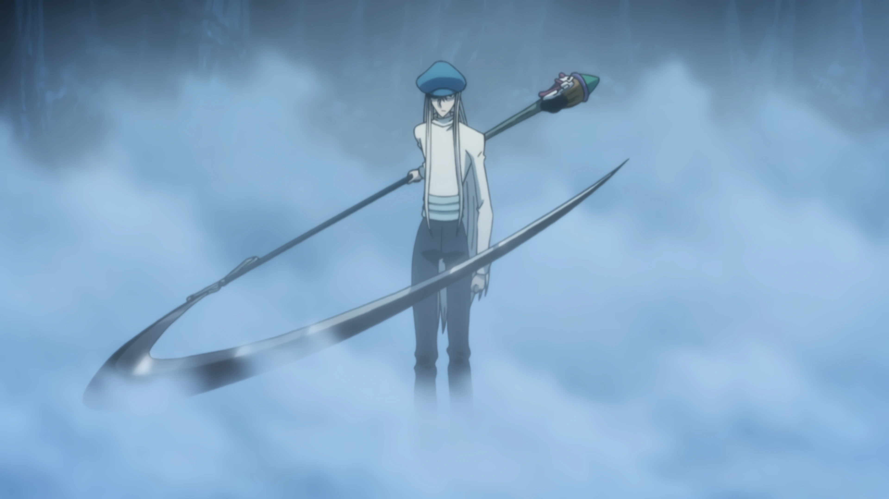

[](https://github.com/gongahkia/kite/releases/tag/1.0.0) 

# `Kite` 🪄

...

## Stack

...

## Usage

```console
...
```

...

```py
# ...
```

## Architecture

...

## Reference

The name `Kite` is in reference to [Kite](https://hunterxhunter.fandom.com/wiki/Kite) (カイト), a prominent [Hunter](https://hunterxhunter.fandom.com/wiki/Hunter_Association) discipled by [Ging Freecss](https://hunterxhunter.fandom.com/wiki/Ging_Freecss) who later acts as [Gon Freecss](https://hunterxhunter.fandom.com/wiki/Gon_Freecss)'s mentor. He is subsequently killed by the [Royal Guard](https://hunterxhunter.fandom.com/wiki/Royal_Guards) [Neferpitou](https://hunterxhunter.fandom.com/wiki/Neferpitou) and reborn as the [Chimera Ant](https://hunterxhunter.fandom.com/wiki/Chimera_Ants) [Reina](https://hunterxhunter.fandom.com/wiki/Kite#Chimera_Ant) in the [Chimera Ant arc](https://hunterxhunter.fandom.com/wiki/Chimera_Ant_arc) of the ongoing manga series, [HunterXhunter](https://hunterxhunter.fandom.com/wiki/Hunterpedia).  

